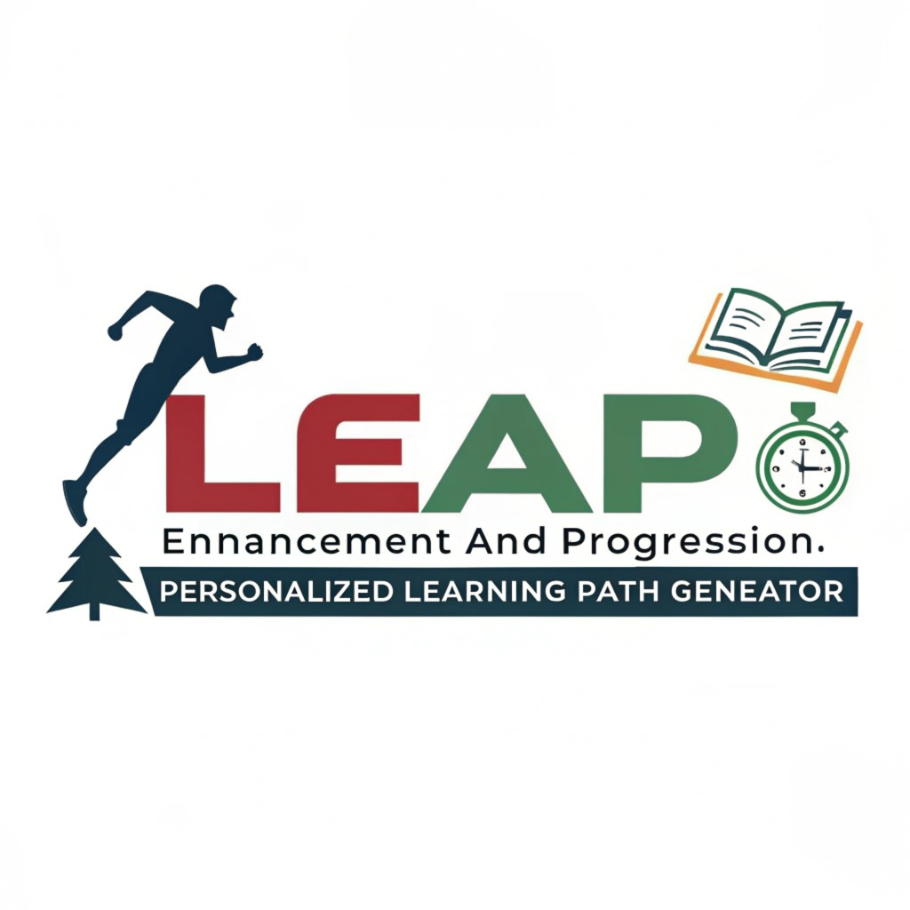

# LEAP - Learning Enhancement And Progression📚🚀

    

LEAP is a web application that generates a personalized learning path based on your educational background, skills, and goals. The app uses an AI model to create a customized plan and allows you to download it as a `.docx` file. Built using Python, Streamlit, and the GROQ LLM API, the application generates comprehensive learning paths with key concepts, curated resources, and estimated completion timelines. Features include automated document generation for learning plans, and intelligent resource recommendations from trusted platforms. The tool helps users efficiently plan their learning journey by breaking down complex career transitions into structured, actionable steps with specific time estimates and progress tracking capabilities.

# Features🌟
- Generates a customized learning path based on user input.
- Displays a timeline-style learning path.
- Allows users to download the learning path as a `.docx` file.
- Securely handles sensitive information like API keys using environment variables.

# Streamlit App🔗
Link: https://leap-learning-path-generator.streamlit.app/

# Prerequisites⚙️

Before running the application, ensure you have the following installed:
- Python 3.x or later
- Streamlit
- Requests
- python-dotenv
- docx

# Setting Up the Environment 
# Step 1: Clone the Repository
git clone https://github.com/gudashashank/LEAP

cd learning-path-generator

# Step 2: Create and Activate Virtual Environment
Create virtual environment:
python3 -m venv venv

Activate virtual environment (Linux/Mac):
source venv/bin/activate

Activate virtual environment (Windows):
.\venv\Scripts\activate

# Step 3: Install Required Dependencies
pip install -r requirements.txt

# Step 4: Set up your environment variables
Create a .env file in the root of your project directory.
Add the necessary API keys or environment variables in the .env file. For example:

API_KEY=your-api-key-here

# Step 5: Make sure your .gitignore file is properly set up to ignore the .env file
Add .env to the .gitignore to prevent accidentally committing your API key to GitHub:

.env

# Step 6: Run the Application
streamlit run app.py

## How It Works 🤖
**User Input:** The user provides their educational background, skills, and goals in the text areas on the web app.
**Generate Learning Path:** Upon clicking the "Generate Learning Path" button, the app processes the input using the AI model and generates a customized learning path.
**Download:** The learning path is displayed on the page, and the user can download it as a .docx file for further use.

## Contributing 🤝
If you would like to contribute to this project, feel free to:

Fork the repository
Create a new branch
Submit a pull request
Your contributions are always welcome!

**Made with 💙 by [Shashank Guda](https://shashankguda.me)**
